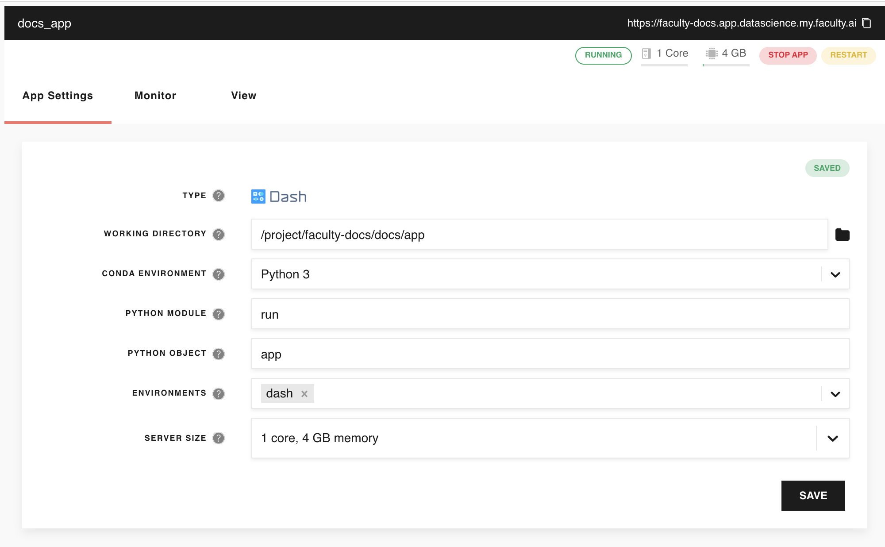

***************************
How to present Faculty docs
***************************

Build docs in different formats
===============================

Explain how to generate html files, single html files and pdfs via make file.

Host docs on the Faculty Platform
=================================

This section describes how you can "deploy" your docs as a Plotly Dash app on the Faculty Platform. While this is really useful during development, 
it is often not the best option for sharing your docs; the reasons being that, in order to view docs deployed on the platform, the user will have to have a platform account and that it also takes away compute resources from other projects when it's actually much easier to 
send the html files to your client. A better option might be to host the docs on bitbucket or gitlab, where they will be 
automatically updated whenever they are updated (a future version of this documents will explain how you can do that).

To "deploy" your docs as an app on the platform after you have built them and they are in ``_build``:
    * Go to **Deployments** on the Platform and create a new Dash deployment. That is, enter a name, a domain name and select "Dash" as the deployment type.
    * Configure your app. First, enter the global path of your ``app`` directory in your docs as working directory and set the other parameters as shown in the Fig. 1 below.
    * Start the app and then click at the link to your docs to look at them.
    
An example workflow during development of your docs in this way could be:
    * Change your docs as you want.
    * Create the new html files by executing ``build_docs``
    * Visit the domain of your docs to look at the new docs (refresh the page if necessary; ``cmd`` + ``shift`` + ``R`` on a Mac).
    
Remember to stop the app as soon as it's no longer needed.

    `Fig. 1:` The configuration for your documentation app.

Integrate docs into the gitlab CI/CD pipeline
=============================================

